 
 
\[[🇧🇷 Português](README.pt_BR.md)\] \[**[🇺🇸 English](README.md)**\]
  

  

## 𝚿  [Health Team Management](): *Gaslighting at Work — Strategies for Self-Defense and Healthy Management*

 

 A Psychological Guide for Managers, HR Professionals, Psychologists, Students Entering the Job Market, and Victims - [*How to Recognize, Prevent, and Overcome Psychological Manipulation in Professional Environments*]()

  

   
 

<!-- ===================Video Under Costruction =================================
https://github.com/user-attachments/assets/bbf7d69a-cb47-4342-9ce5-88bf6ae7ce0b
==================================================================================-->

  

#### 
 

  

This material was developed with the purpose of providing **psychological support, professional guidance, and solid scientific grounding** to victims and managers who seek to understand and effectively address the phenomenon of *gaslighting* in the workplace — [both in Brazil and in international contexts]().

The content brings together contributions from **Organizational, Clinical, and Humanistic Psychologists**, as well as **Data Scientists specialized in Artificial Intelligence**, affiliated with the Department of Applied Social Sciences at FEA-PUC-SP.

It also includes the collaboration of [**Fabiana Campanari**](https://linktr.ee/fabianacampanari), Organizational Psychologist at PUC-SP and undergraduate student in [**Humanistic AI and Data Science**](mailto:fabicampanari@proton.me) at the same institution.

The academic and institutional coordination is under the supervision of [**Professor Dr. Mitz Cruz**, Psychologist and Pro-Rector for Culture and Community Relations at PUC-SP](), and [**Professor Dr. Dora Kaufman**, Coordinator of Ethics in Artificial Intelligence at TIDD-PUC-SP]().

These professionals lead reference centers in [**Soft Skills, Human Resources Research, Workplace Health**, and **AI Ethics**]().

 

#  

  

<!--End-->

> [!TIP]
>
> [-]() Research conducted by the undergraduate programs in[:]()
>
>   * [**Humanistic AI and Data Science**]() at PUC-SP
>
>   * [**Organizational Psychology**]() at PUC-SP
>
>   * [**TIDD-PUC-SP**]()
>  
> 

    

=================================================================================

### ⚠️ 🌱 Still Building, Transforming and Improving — in Life, in Soul and in This Repository 🌻

==================================================================================

    

 

## The 4 Steps that Compose the Phenomenon of Narcissistic Symbolic Appropriation (MIMIC)

 

➠ [🪞 See in Detail here](https://github.com/Mindful-AI-Assistants/HealthTeam-GaslightingResearch-Repository/blob/e02b0037b04347adf7513a7166b6fc9310b4c77b/%F0%9F%AA%9EGaslighters_Psych_Profile%20_%20Victims_Symbolic_Appropriation_(MIMIC).md)

  

1. **Observation:** Mapping victim’s respected traits—technical skills, communication, personality markers.  
2. **Elimination:** Removing the victim from visibility and recognition.  
3. **Adoption:** Gradually incorporating intellectual contributions, style, and personal identity markers.  
4. **Double Harm:**  
   - **Invisibility:** Victim’s originality and identity are erased.  
   - **Symbolic Gain:** Gaslighter strengthens status and influence by impersonating the victim.

  

    

###### 
  🪞*Narciso - Symbolic Appropriation (Mimic): Observation, Elimination, Adoption*

  

[✨ See Full Diagram →](#)

```mermaid
%%{init: {'theme':'dark', 'themeVariables': { 'primaryColor': '#1ABC9C', 'primaryBorderColor': '#16A085', 'lineColor': '#1ABC9C', 'fontSize': '16px'}}}%%

flowchart TD
    A[🔍 Observation<br/>Mapping victim’s admired traits] --> B[🚫 Elimination<br/>Excluding the victim from visibility and influence]
    B --> C[🎭 Adoption<br/>Appropriating intellectual contributions and personal identity markers]
    C --> D[⚡ Double Harm<br/>Invisibility of victim + Symbolic gain for gaslighter]
    D -.-> A

style A fill:#0a0a0a,stroke:#1ABC9C,stroke-width:2px
style B fill:#0a0a0a,stroke:#1ABC9C,stroke-width:2px
style C fill:#0a0a0a,stroke:#1ABC9C,stroke-width:2px
style D fill:#0a0a0a,stroke:#1ABC9C,stroke-width:2px
```

  

  

  
  
  
  
  
  

## 💌 [Let the data flow... Ping Me !](mailto:fabicampanari@proton.me)

 

#### 
  🛸๋ My Contacts [Hub](https://linktr.ee/fabianacampanari)

 

### 
 

  

  ────────────── ⊹🔭๋ ──────────────

<!--

  ────────────── 🛸๋*ੈ✩* 🔭*ੈ₊ ──────────────
-->

 

 ➣➢➤ <a href="#top">Back to Top </a>
  

  
#
 
##### 
Copyright 2025 Mindful-AI-Assistants. Code released under the  [MIT license.](https://github.com/Mindful-AI-Assistants/CDIA-Entrepreneurship-Soft-Skills-PUC-SP/blob/21961c2693169d461c6e05900e3d25e28a292297/LICENSE)

